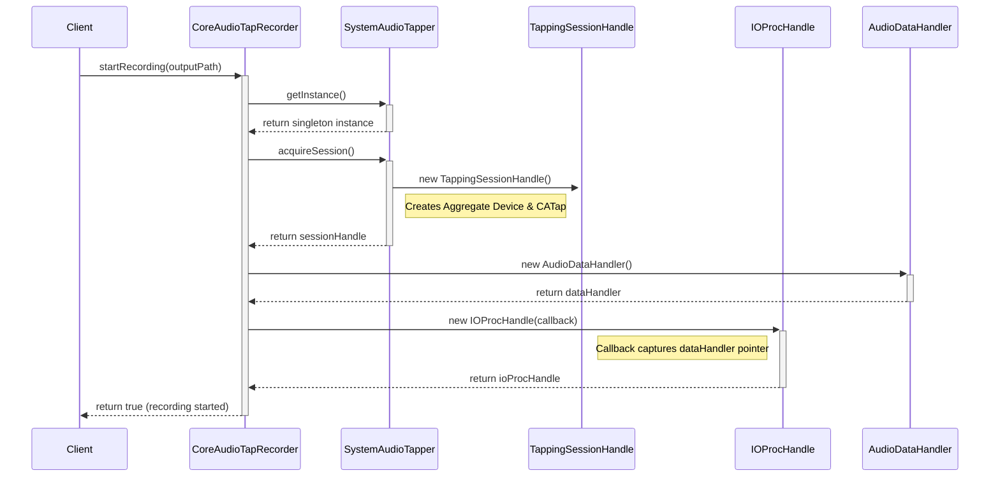
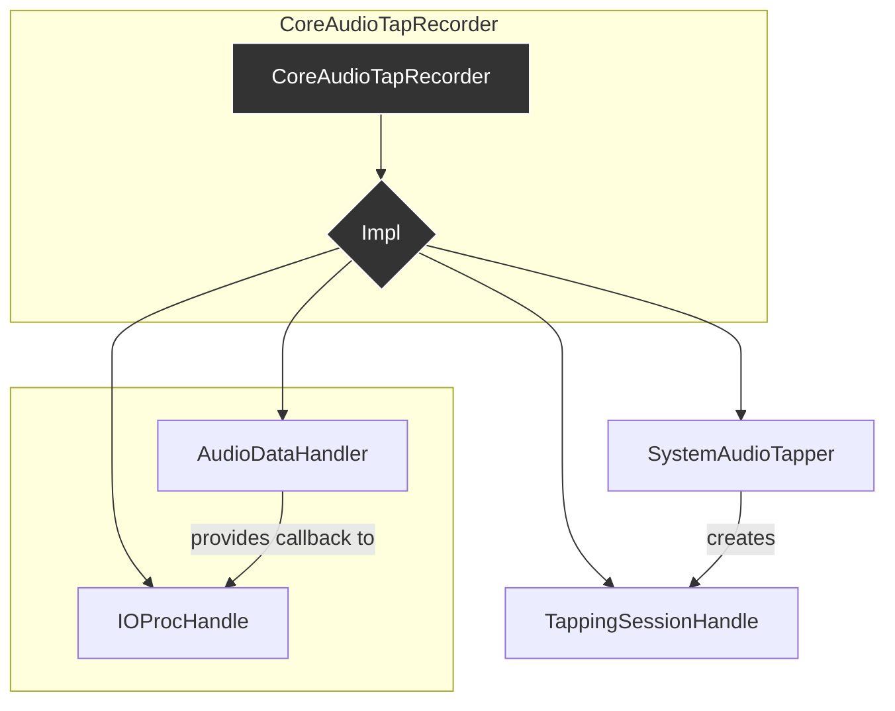
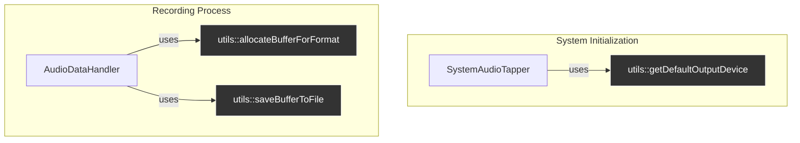
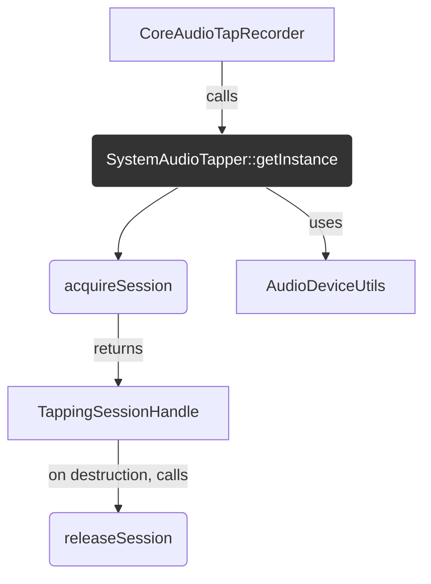
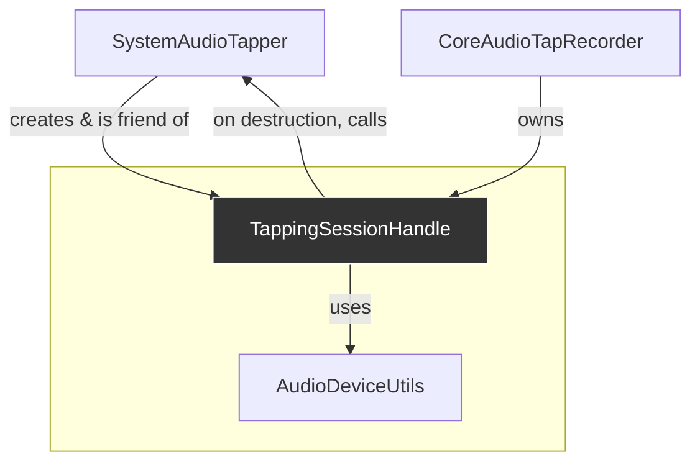
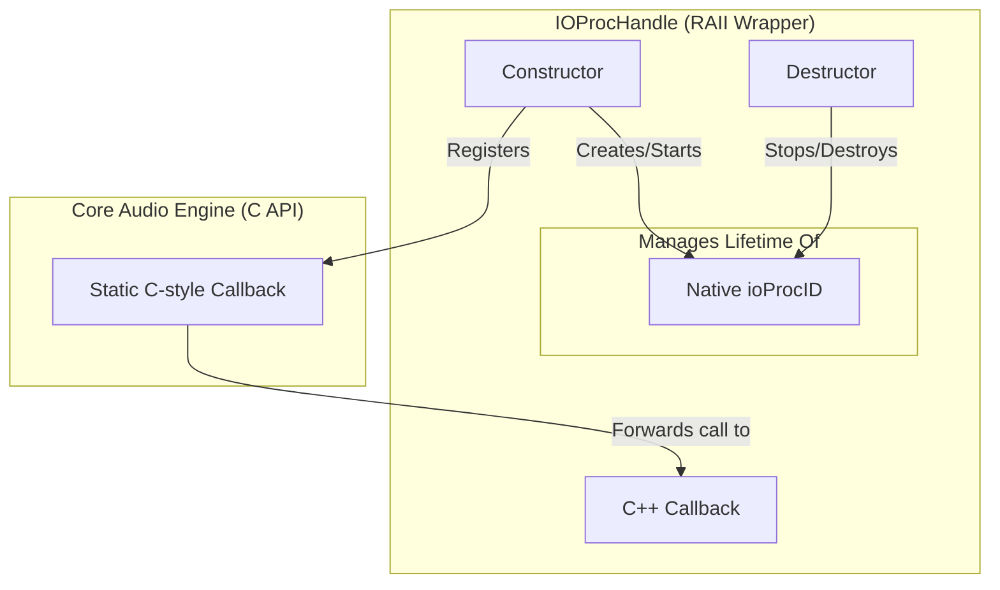
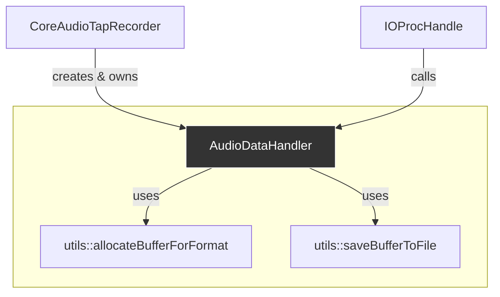
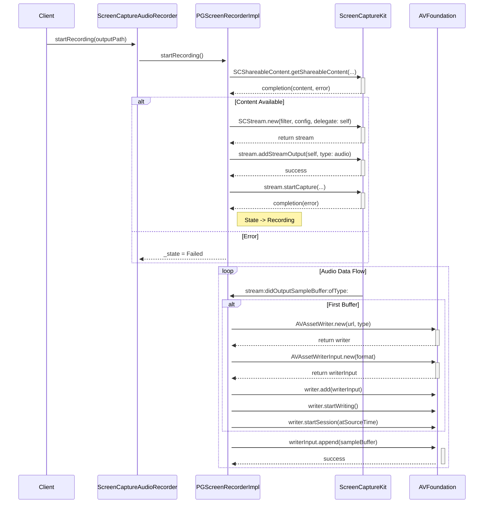
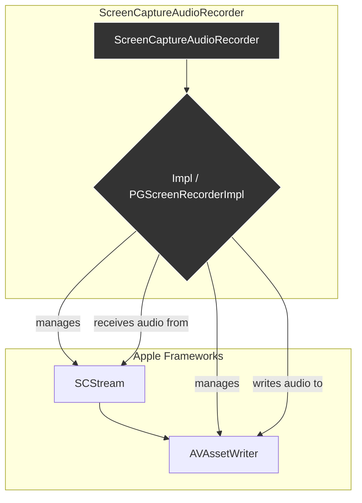

# Audio Capture POC Report

This document provides a technical overview and comparison of two Proof of Concept (POC) implementations for capturing system audio on macOS: Core Audio Tap and ScreenCaptureKit.

---

## Part 1: Core Audio Tap POC

### 1.1. Introduction: What is Core Audio Tap?

Core Audio Tap is a mechanism provided by Apple's Core Audio framework on macOS that allows an application to "tap into" and monitor the audio data of a running process or a system audio device.

For this POC, the primary goal is to tap into an **aggregate audio device** that contains system **default audio device**. An aggregate device is a virtual audio device in macOS that combines multiple physical audio inputs and outputs into a single, unified virtual device. By tapping this device, we can capture the system's mixed audio output.

### 1.2. How to Initialize and Listen for Output

The process of setting up a Core Audio Tap involves several steps using specific Core Audio APIs to create the necessary components and hook into the audio stream.

The general workflow is as follows:

1.  **Get Default Output Device**: Identify the system's current default audio output device. This is the device whose audio we intend to capture.
2.  **Create Tap Description**: An instance of `CATapDescription` is created. It is configured to tap the default output device identified in the previous step and can specify which processes to include or exclude. The key API for this is `-[CATapDescription initWithProcesses:andDeviceUID:withStream:]`.
3.  **Create Aggregate Device**: An aggregate device is created based on the tap description. This virtual device will expose the tapped audio stream.
4.  **Create Process Tap**: With the description configured, the actual tap is created by calling `AudioHardwareCreateProcessTap`, which provides the `AudioObjectID` of the new tap via an output parameter.
5.  **Set Up IO Callback**: To process the audio data, an I/O procedure (a callback function) is registered with the aggregate device using `AudioDeviceCreateIOProcID`. Once registered, the device is started with `AudioDeviceStart`.
6.  **Process Audio**: After the device is started, the registered callback function is repeatedly invoked, receiving audio data in an `AudioBufferList` which can then be processed or saved.

### 1.3. How to Detect Device Changes

To ensure the tap remains valid and handles system changes gracefully, it's necessary to listen for property changes on the audio devices.

This is achieved by registering a property listener with `AudioObjectAddPropertyListener`. This function takes an `AudioObjectPropertyAddress`, which specifies a set of properties to monitor. When a monitored property changes (e.g., the sample rate of a device is altered), a registered callback function is invoked, allowing the application to react accordingly.

### 1.4. Current Implementation Status

The current POC successfully implements the core tapping functionality with the following characteristics:

-   **Taps Default Device**: The implementation listens to the system's default output device. As a result, it can capture audio from any application that outputs to this device.
-   **Self-Monitoring**: Currently, if our own application plays audio to the default device, that audio is also captured. This can be resolved by configuring the `CATapDescription` to exclude our own process.
-   **CAF Output**: When recording is stopped, the captured audio is saved to a file in the Core Audio Format (CAF). The audio data is currently uncompressed.
-   **Handles Configuration Changes**: If the properties of the tapped device change (e.g., sample rate), the recording will automatically stop.
-   **Known Limitation**: If the user switches the system's default device *after* recording has started (e.g., from built-in speakers to headphones), the recording continues but will not capture audio from the new device.

### 1.5. Implementation Details

The implementation is structured with a primary coordinator class, `CoreAudioTapRecorder`, which uses the Pimpl idiom. The private implementation (`CoreAudioTapRecorder::Impl`) owns and manages several RAII (Resource Acquisition Is Initialization) wrapper classes that handle the complexities of Core Audio objects.

The following sequence diagram illustrates the initialization flow when `startRecording` is called:

And this class diagram shows the high-level ownership and dependency relationships:

#### CoreAudioTapRecorder (The Coordinator)

The `CoreAudioTapRecorder` class serves as the public-facing interface for the audio tapping functionality. Its internal `Impl` class coordinates the different components of the system. It owns the main RAII wrappers for:

-   The tap session itself (`TappingSessionHandle`)
-   The audio data handling and file writing (`AudioDataHandler`)
-   The Core Audio IO procedure callback (`IOProcHandle`)

#### RAII Wrappers for Core Audio Objects

The implementation is broken down into several classes, each responsible for managing a specific Core Audio object or concept. This encapsulates the C-style Core Audio APIs in a C++ interface.

##### `AudioDeviceUtils` (Utility Functions)
The `audio_tap::utils` namespace serves as a collection of free-standing, stateless utility functions that perform common, low-level tasks related to Core Audio and file handling.

##### `SystemAudioTapper` (Singleton Tap Manager)
`SystemAudioTapper` is the singleton entry point for creating and managing the underlying Core Audio objects required to tap system audio (the `CATap` and the aggregate device). It uses a session-based reference counting model.

##### `TappingSessionHandle` (RAII Session Handle)
`TappingSessionHandle` is a non-copyable, move-only RAII handle that represents an active audio tapping session. Its primary role is to manage the session's lifecycle and provide an interface to the session's properties and events.

##### `IOProcHandle` (RAII IO Callback Handle)
`IOProcHandle` encapsulates the setup and teardown of a real-time audio callback (`AudioDeviceIOProcID`). Its primary purpose is to provide a safe, C++ interface for an otherwise verbose and error-prone C-style API. The diagram below illustrates its internal RAII mechanism for managing the native Core Audio callback.

*   **Lifecycle Management**: The `IOProcHandle`'s constructor creates and starts the native `ioProcID`, while the destructor guarantees it is stopped and destroyed. This is the core of its RAII responsibility.
*   **Callback Bridging**: The constructor registers a static C-style function with the Core Audio engine. When the engine has audio data, it calls this static function, which in turn forwards the call to the C++ callback provided to the `IOProcHandle`, safely bridging the C and C++ worlds.

##### `AudioDataHandler` (Data Sink)
`AudioDataHandler` has a clear and focused responsibility: to manage a pre-allocated audio buffer, copy incoming audio data into it, and save the result to a file when requested.

### 1.6. TODO List

-   Investigate alternative `CATapDescription` initializers beyond the current approach of tapping a single device. The goal is to explore more robust methods for system-wide audio capture. This includes, but is not limited to:
    -   Tapping a mixdown of specific processes (`initStereoMixdownOfProcesses:`).
    -   Using a global tap that excludes certain processes (`initStereoGlobalTapButExcludeProcesses:`), which seems like a promising option for capturing all system audio except our own application.
    -   Experimenting with different combinations of aggregate devices and tap configurations.
-   Address the known limitation where switching the default audio device during a recording session does not stop the recording or switch the tap to the new device.

---

## Part 2: ScreenCaptureKit POC

### 2.1. Introduction: What is ScreenCaptureKit?

ScreenCaptureKit is a modern Apple framework designed for high-performance screen recording. While its primary function is capturing video from displays and applications, it also provides robust capabilities for capturing system audio.

For this POC, we leverage ScreenCaptureKit to capture the system-wide audio mix, which includes audio from all applications. This approach offers a more resilient alternative to lower-level Core Audio APIs, as it is less affected by changes in the user's audio device configuration.

Key resources:
-   Apple Documentation: [ScreenCaptureKit](https://developer.apple.com/documentation/screencapturekit)
-   Inspiration from Open Source: [QuickRecorder](https://github.com/lihaoyun6/QuickRecorder)

### 2.2. How to Initialize and Capture Output

The initialization process involves creating and configuring an `SCStream` object to capture audio data and an `AVAssetWriter` to write that data to a file.

The general workflow is as follows:

1.  **Get Shareable Content**: Call `[SCShareableContent getShareableContentExcludingDesktopWindows:onScreenWindowsOnly:completionHandler:]` to **asynchronously** fetch a list of capturable content (displays, windows, etc.). This step also implicitly handles screen recording permissions.
2.  **Create a Content Filter**: An `SCContentFilter` is created to define what content will be captured. For our purposes, this is configured to capture the main display (`initWithDisplay:excludingWindows:`).
3.  **Configure the Stream**: An `SCStreamConfiguration` object is created. The crucial setting for our use case is `config.capturesAudio = YES;`. We must also set a minimal video size (e.g., 2x2 pixels) because the framework requires a video track to be configured, even if we don't process it.
4.  **Create the Stream**: An `SCStream` instance is initialized with the filter, configuration, and a delegate object. The delegate must conform to `SCStreamDelegate` and `SCStreamOutput`.
5.  **Add Stream Output**: The delegate is added as an output handler for `SCStreamOutputTypeAudio` by calling `[stream addStreamOutput:self type:...]`. This directs the captured audio samples to our delegate methods. A handler for `SCStreamOutputTypeScreen` must also be added to satisfy the framework's requirements, but we can ignore the video samples it provides.
6.  **Start Capture**: Call `[stream startCaptureWithCompletionHandler:]` to begin the asynchronous capture process.
7.  **Receive Audio Data**: The delegate method `-stream:didOutputSampleBuffer:ofType:` will be called repeatedly with audio data encapsulated in a `CMSampleBufferRef`.
8.  **Write to File**: The first time an audio buffer is received, an `AVAssetWriter` and `AVAssetWriterInput` are initialized. Subsequent buffers are appended to the file until the stream is stopped.

### 2.3. Current Implementation Status

-   **System-Wide Audio Capture**: The POC successfully captures the mixed audio output of the entire system, not tied to a specific audio device.
-   **Resilience to Device Changes**: A key advantage of this method is its resilience. The recording continues uninterrupted and captures audio correctly even if the user changes the default audio device (e.g., switches from speakers to headphones) or modifies the sample rate during the session.
-   **M4A (AAC) Output**: The captured audio is written to an M4A file (`.m4a`) using the AAC codec for efficient compression.
-   **Asynchronous Operation**: The entire recording process is asynchronous and callback-based, ensuring the main thread is not blocked.
-   **Permission Handling**: The implementation correctly handles scenarios where screen capture permission has not been granted.

### 2.4. Implementation Details

The implementation is encapsulated within the `ScreenCaptureAudioRecorder` C++ class, which uses the Pimpl idiom to hide the Objective-C details.

The following sequence diagram illustrates the asynchronous initialization and data handling flow:

The high-level class diagram below shows the primary components managed by the implementation:

#### Pimpl Implementation (`PGScreenRecorderImpl`)

The core logic resides in `PGScreenRecorderImpl`, an Objective-C class that acts as the delegate and handler for the ScreenCaptureKit stream.

-   **Delegate and Handler**: It conforms to the `SCStreamDelegate` and `SCStreamOutput` protocols to manage the stream's lifecycle and process incoming data.
-   **State Management**: It uses an internal state machine (`PGRecorderState`) to track the recorder's status (Idle, Starting, Recording, Stopping, Succeeded, Failed), ensuring operations are performed in the correct sequence.
-   **Component Coordination**: It is responsible for orchestrating the interaction between the `SCStream` (capturing) and the `AVAssetWriter` (file writing). When the first audio buffer arrives, it configures and starts the asset writer. When `stopRecording` is called, it finalizes the asset writer and then stops the capture stream.

### 2.5. TODO List

-   N/A

---

## Part 3: Comparison and Analysis

This section compares the two implemented approaches based on the current POCs.

### 3.1. ScreenCaptureKit

-   **Pros**:
    -   **Resilience to Device Changes**: It is not bound to a specific audio device and automatically handles changes in the system's default output device or sample rate without interrupting the recording. This is a significant advantage for user experience.
    -   **Stable and Well-Documented**: As a more established framework, it has more comprehensive documentation and a larger body of community knowledge and open-source examples to draw from.

-   **Cons**:
    -   **Objective-C++ Integration Complexity**: The API is almost entirely Objective-C. This requires using Objective-C++ as a bridge, which is notoriously complex and error-prone. For example, an AI agent (or a human developer) can easily make mistakes that are difficult to debug, such as attempting to forward-declare an Objective-C class inside a C++ namespace, which results in uncompilable code. This steepens the learning curve and adds significant development overhead.
    -   **High-Level Abstraction**: The use of `CMSampleBufferRef` and `AVAssetWriter` for file handling is convenient but also abstract. It offers less direct control over the raw audio buffers, which could be a limitation for more advanced processing needs.

### 3.2. Core Audio Tap

-   **Pros**:
    -   **Extension of Core Audio C API**: The API is an extension of the existing Core Audio C-based framework. For developers already proficient with Core Audio's architecture, this allows for a more straightforward integration using familiar patterns. However, it retains the verbosity and manual resource management typical of C-style APIs.
    -   **Low-Level Control**: Provides direct access to raw audio buffers (`AudioBufferList`), offering maximum flexibility for custom processing, analysis, or writing to proprietary formats.

-   **Cons**:
    -   **Device Change Brittleness**: The current implementation, which taps the default device, is not resilient to the user changing the default device mid-recording. This forces a recording stop and is a major drawback.
    -   **Poorly Documented and Very New**: The `AudioHardwareProcessTap` API is extremely new and lacks thorough documentation or examples, making development and troubleshooting difficult and time-consuming.

### 3.3. Summary

| Feature                      | ScreenCaptureKit                                     | Core Audio Tap                                       |
| ---------------------------- | ---------------------------------------------------- | ---------------------------------------------------- |
| **Resilience**               | **Excellent**: Handles device changes gracefully.    | **Poor**: Breaks on default device change.           |
| **Documentation**            | **Good**: Established framework.                     | **Poor**: New, very limited resources.               |
| **Language**                 | **Objective-C**: Verbose, requires bridging.       | **C API**: Familiar for Core Audio devs; verbose.    |
| **Control Level**            | **High-Level**: Less control over raw audio buffer.  | **Low-Level**: Full control over audio buffers.      |
| **Development Experience**   | **Moderate**: More stable but requires Obj-C skills. | **Difficult**: Painful due to lack of docs and API novelty. |
---

## Part 4: Developer's Note: Core Audio Knowledge is Unavoidable

A developer might be tempted to choose ScreenCaptureKit over Core Audio Tap to avoid the perceived complexity of the Core Audio framework. While ScreenCaptureKit does abstract away the difficult parts of device discovery and tap management, it is crucial to understand that it does **not** abstract away the fundamental Core Audio data structures.

This becomes evident the moment you receive audio data:

-   **ScreenCaptureKit** provides audio wrapped in a `CMSampleBufferRef`. To do anything useful with this, one must still interact with Core Audio concepts by extracting the `AudioStreamBasicDescription` (ASBD) to understand the format, and then accessing the raw audio blocks.
-   **Core Audio Tap**, being a direct extension of the framework, naturally exposes this data in its raw `AudioBufferList` form.

The key takeaway is that there is no true escape from Core Audio's C-API fundamentals. While ScreenCaptureKit simplifies the setup, any serious audio processing, file writing (`AVAssetWriter`, `ExtAudioFile`), or debugging will inevitably require a solid understanding of structures like ASBD and `AudioBufferList`. A developer unfamiliar with these will struggle with either SDK when issues arise. Therefore, proficiency in Core Audio should be seen as a prerequisite for using either technology effectively.