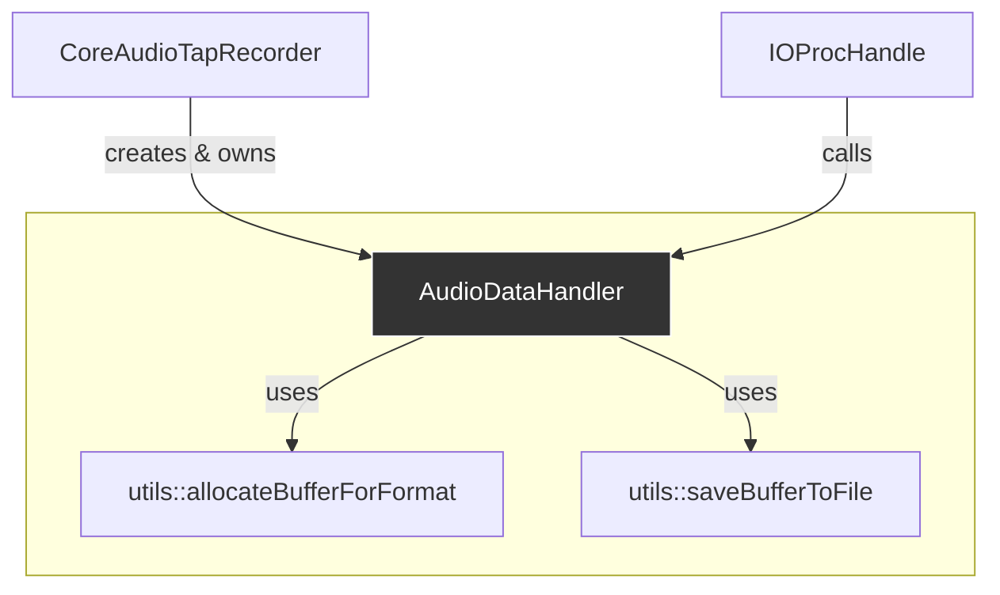

# Analysis: `AudioDataHandler`

**Last Updated**: 2025-07-22

This document provides a detailed analysis of the `AudioDataHandler` class. This class has a clear and focused responsibility: to manage a pre-allocated audio buffer, copy incoming audio data into it, and save the result to a file when requested.

## 1. Current Functionality & Relationships

`AudioDataHandler` acts as a data sink and processor. It is decoupled from the complexities of Core Audio setup and is designed to be controlled by a higher-level class (`CoreAudioTapRecorder`).

### Core Functions:

*   **Constructor (`AudioDataHandler(format, durationInSeconds)`)**: Upon construction, it immediately allocates its internal `audioBuffer_` by calling `utils::allocateBufferForFormat`.
*   **`process(inInputData)`**: This is the real-time critical method. It is called repeatedly by the `IOProc` (via a lambda in `IOProcHandle`) with new audio data. It copies the incoming samples into `audioBuffer_`, advancing an atomic index.
*   **`saveToFile(file, format)`**: This method is called from a non-real-time thread. It first truncates the buffer to the actual recorded size (using the atomic index) and then calls `utils::saveBufferToFile` to handle the file writing.
*   **`setBufferFullCallback(callback)`**: Allows the owning class to register a callback that is triggered when the buffer runs out of space.

### Relationships with Other Components:

*   **`CoreAudioTapRecorder`**: Creates, owns, and orchestrates the `AudioDataHandler`. It sets the `onBufferFull_` callback.
*   **`IOProcHandle`**: Holds a lambda that calls the `process` method on every audio buffer received from the system.
*   **`utils` namespace**: It delegates buffer allocation and file saving tasks to the utility functions.

## 2. Implementation Analysis & Improvement Suggestions

The class is simple, but its interaction with real-time audio threads and atomic variables warrants careful analysis.

### Analysis of `process()` Method (Real-time Critical)

*   **Good**: The use of `std::atomic<size_t>` for `bufferIndex_` is absolutely correct and essential for safe communication between the real-time audio thread (writer) and the main thread (reader, in `saveToFile`).
*   **Good**: The logic correctly checks if there is enough space before copying, preventing buffer overflows.
*   **Could Improve (Potential for data loss)**: The current logic is `if (can fit) { copy } else { signal full }`. If `currentIndex + samplesInBuffer` is greater than `audioBuffer_.size()`, the *entire* incoming buffer is dropped. A more robust implementation would fill the remaining space in `audioBuffer_` with a partial copy from the incoming buffer and *then* trigger the `onBufferFull_` callback. This would prevent losing the last few milliseconds of audio.
*   **Could Improve (Real-time Safety)**: The `process` method contains a call to `onBufferFull_()`, which is a `std::function`. Calling a `std::function` on a real-time audio thread can be risky. It can potentially allocate memory (if it's a large lambda) or perform other non-real-time-safe operations, which could cause audio glitches. While the current lambda passed by `CoreAudioTapRecorder` is simple, it's a potential weak point in the design.

### Analysis of Constructor and `saveToFile()`

*   **Good**: The constructor uses a helper function for allocation, keeping its own logic clean.
*   **Good**: `saveToFile` correctly resizes the buffer to the *actual* amount of data written before saving, which is efficient and correct.
*   **Could Improve (API Design)**: As noted in the `AudioDeviceUtils` analysis, the constructor takes `durationInSeconds` as a raw `int`. This should be a `std::chrono::seconds` for type safety.
*   **Could Improve (Resource Management)**: In `saveToFile`, the `audioBuffer_` is resized. This modifies the state of the `AudioDataHandler`. After `saveToFile` is called, the handler is not in a reusable state. While the current lifecycle in `CoreAudioTapRecorder` destroys and recreates the handler for each recording, a cleaner design might be for `saveToFile` to not mutate the internal state, or for the class to have an explicit `reset()` method.

## 3. Refactoring Plan

### Phase 1: Improve Real-time Safety and Robustness

1.  **Refine `process()` Logic**:
    *   Modify the `else` block in `process()` to handle partial copies.
    *   Calculate the remaining space: `size_t remainingSpace = audioBuffer_.size() - currentIndex;`.
    *   If `remainingSpace > 0`, copy `remainingSpace` samples from the input buffer.
    *   Update the atomic index.
    *   *Then*, call `onBufferFull_()`. This ensures no data is lost at the very end of the recording.

2.  **Make Callback Safer**:
    *   Change the `onBufferFull_` member from `std::function<void()>` to a function pointer or a simpler, non-allocating callable type.
    *   *Alternative*: A better approach would be to remove the callback entirely. Instead, the `process` method could return a `bool` status (e.g., `true` for "continue", `false` for "buffer is now full"). The lambda in `IOProcHandle` would check this return value and then be responsible for dispatching the stop signal to the main thread. This moves the non-real-time-safe logic out of the `AudioDataHandler::process` method completely, making it safer.

### Phase 2: Enhance API and State Management

1.  **Introduce Type-Safe Duration**:
    *   Change the constructor parameter from `int durationInSeconds` to `std::chrono::seconds duration`, propagating the change from the refactoring plan for `CoreAudioTapRecorder`.

2.  **Clarify State Lifecycle**:
    *   Consider adding a `reset()` method to `AudioDataHandler`. After `saveToFile` is called, the `CoreAudioTapRecorder` could call `reset()` if it intended to reuse the handler (though the current approach of recreating it is also perfectly valid and perhaps simpler). This refactoring is minor and depends on future use cases. For now, the current design is acceptable but worth documenting.

The most critical refactoring for this class is improving the `process()` logic to handle partial buffer fills and to move the `std::function` call out of the real-time path, making the system more robust and safe.