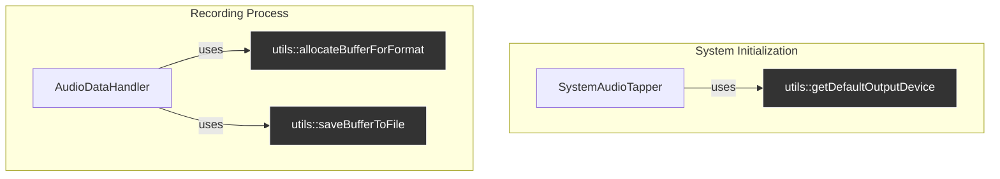

# Analysis: `AudioDeviceUtils`

**Last Updated**: 2025-07-22

This document provides a detailed analysis of the `AudioDeviceUtils` component, which consists of `AudioDeviceUtils.h` and `AudioDeviceUtils.mm`.

## 1. Current Functionality & Relationships

The `audio_tap::utils` namespace serves as a collection of free-standing, stateless utility functions that perform common, low-level tasks related to Core Audio and file handling. These functions are highly cohesive and loosely coupled from the main recorder logic.

### Core Functions:

*   **`getDefaultOutputDevice()`**: Queries the system for the default audio output device ID. This is a fundamental operation needed by `SystemAudioTapper` to know which device to target for creating an aggregate device.
*   **`allocateBufferForFormat(format, durationInSeconds)`**: Calculates the required size and allocates a `std::vector<float>` to serve as an audio buffer. This is used by `AudioDataHandler` to prepare its internal buffer for storing incoming audio.
*   **`saveBufferToFile(format, file, buffer)`**: Handles the complex process of writing a raw float audio buffer to a CAF file using the `ExtAudioFile` API. This was refactored out of `CoreAudioTapRecorder` and is now used by `AudioDataHandler` to persist the recorded audio.

### Relationships with Other Components:

## 2. Implementation Analysis & Improvement Suggestions

Overall, the code is clean, modern, and follows good practices. However, several areas could be improved for even greater safety, clarity, and robustness.

### Analysis of `getDefaultOutputDevice()`

*   **Good**: Correctly uses Core Audio properties to fetch the device ID.
*   **Could Improve**: The function returns `kAudioObjectUnknown` on failure. While functional, `std::optional<AudioDeviceID>` would be a more idiomatic and expressive way in modern C++ to represent a value that may or may not be present. This forces the caller to explicitly handle the "not found" case.

### Analysis of `allocateBufferForFormat()`

*   **Good**: Contains a guard clause to prevent division by zero if the format is invalid.
*   **Could Improve**:
    *   **API Design (Type Safety)**: The `durationInSeconds` is passed as a raw `int`. This is prone to ambiguity. What if a caller accidentally passes milliseconds? Using `std::chrono::seconds` would enforce the correct unit at compile time, making the API safer and more self-documenting.
    *   **Calculation**: The `static_cast` to `size_t` is correct, but the multiplication could theoretically overflow if an extremely long duration and high sample rate are provided, although this is highly unlikely in this application's context.

### Analysis of `saveBufferToFile()`

This function is the most complex and has the most room for improvement.

*   **Good**: Correctly uses the `ExtAudioFile` API for saving, which is the right tool for the job.
*   **Could Improve**:
    *   **Error Handling**: The function checks for `OSStatus != noErr` but then simply returns. This "swallows" the error. The caller has no idea that the save operation failed. The function should return a `bool` or, even better, a `std::error_code` (or throw an exception) to indicate success or failure.
    *   **Resource Management (C-style)**:
        *   `CFURLRef` is a Core Foundation object that is manually created with `CFURLCreateFromFileSystemRepresentation` and released with `CFRelease`. This is a classic C-style resource management pattern that is prone to leaks if an early return or exception occurs before the `CFRelease`.
        *   `ExtAudioFileRef` is similarly managed with `ExtAudioFileCreateWithURL` and `ExtAudioFileDispose`. An early return between creation and disposal will leak the file reference.
    *   **Readability & Nesting**: The sequential `if (status != noErr) { ...; return; }` checks create deep nesting and boilerplate. This could be flattened using a "cleanup" object or by changing the error handling strategy.
    *   **Raw Pointer Use**: The use of `const_cast<float *>(buffer.data())` is a code smell. While it's often necessary with older C APIs that weren't `const`-correct, it subverts type safety. The comment should explain *why* it's needed (i.e., the `ExtAudioFileWrite` API expects a mutable pointer even though it only reads from it in this context).

## 3. Refactoring Plan

Based on the analysis, here is a proposed plan to refactor `AudioDeviceUtils`.

### Phase 1: Improve API Type Safety and Error Reporting

1.  **Update `getDefaultOutputDevice`**:
    *   Change the return type to `std::optional<AudioDeviceID>`.
    *   On failure, return `std::nullopt`.
    *   Update the caller (`SystemAudioTapper`) to handle the `std::optional` return type.

2.  **Update `allocateBufferForFormat`**:
    *   Change the `durationInSeconds` parameter to `std::chrono::seconds`.
    *   Update the caller (`AudioDataHandler`) to pass a `std::chrono::seconds` value.

3.  **Update `saveBufferToFile`**:
    *   Change the return type from `void` to `bool`, returning `true` on success and `false` on any failure.
    *   Update the caller (`AudioDataHandler`) to check the return value and log an error if the save operation fails.

### Phase 2: Introduce RAII for Core Foundation / Core Audio Objects

To address the manual resource management issues in `saveBufferToFile`, we can create simple, custom RAII wrappers.

1.  **Create a `CFURLRef` wrapper**:
    *   Define a tiny `struct` or `class` (e.g., `ScopedCFURL`) that takes ownership of a `CFURLRef` in its constructor and calls `CFRelease` in its destructor.

2.  **Create an `ExtAudioFileRef` wrapper**:
    *   Define a similar `ScopedExtAudioFile` wrapper that calls `ExtAudioFileDispose` in its destructor.

3.  **Refactor `saveBufferToFile` to use the RAII wrappers**:
    *   Replace the manual `CFRelease` and `ExtAudioFileDispose` calls with the new scoped objects. This will make the function exception-safe and much easier to read, as the cleanup is guaranteed. The nested `if` statements for error checking can be simplified.

This refactoring will make the utility functions safer, more expressive, and more robust without changing their core logic.