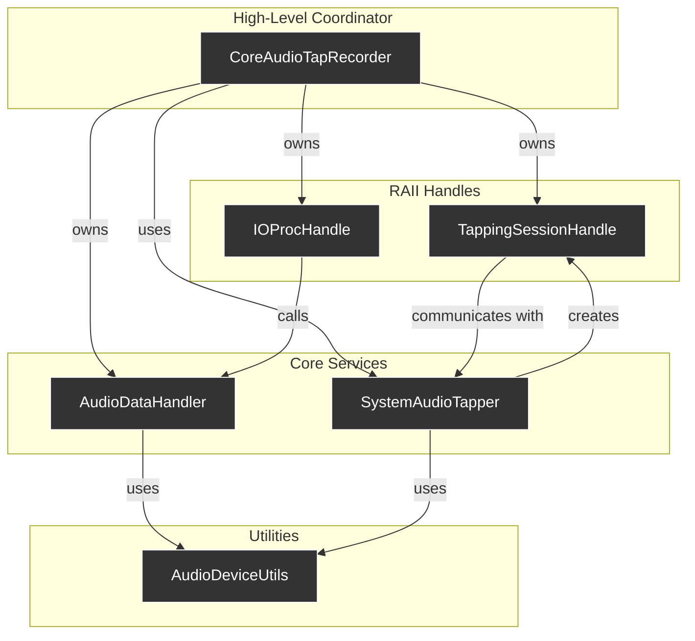

<!-- .slide: data-background-color="#333" -->
# Core Audio Tapping Subsystem
### Survey & Refactoring Plan
**2025-07-23**

---

## Agenda

1.  **Current Architecture**
    *   High-level overview of the components and their relationships.
2.  **Component Analysis**
    *   A summary of findings for each major component.
3.  **Consolidated Refactoring Plan**
    *   A sequential, actionable plan for the next phase.
4.  **Next Steps**
    *   Discussion and implementation.

---

## 1. Current Architecture
<!-- .slide: data-background-color="#f8f8f8" -->

A set of cohesive, decoupled components designed for resource safety and clear separation of concerns.

----

### Component Roles

*   **`CoreAudioTapRecorder`**: The public-facing central coordinator.
*   **`SystemAudioTapper`**: Singleton managing the shared `CATap` and aggregate device.
*   **`TappingSessionHandle`**: RAII handle for a single recording session.
*   **`IOProcHandle`**: RAII handle managing the real-time audio callback.
*   **`AudioDataHandler`**: Buffers and saves audio data.
*   **`AudioDeviceUtils`**: Stateless Core Audio helper functions.

---

## 2. Component Analysis

A summary of findings for each component.

----

### `CoreAudioTapRecorder`

*   **Summary**: A robust state machine coordinator using the Pimpl idiom. Excellent use of RAII handles.
*   **Improvements**:
    *   **API**: Make recording duration configurable. Replace boolean flags with a richer `Status` enum.
    *   **Safety**: The lambda capturing a raw pointer to `AudioDataHandler` is a "code smell," despite being safe due to declaration order.
*   **Details**: [Read the full analysis...](./CoreAudioTapRecorder-analysis.md)

----

### `TappingSessionHandle` & `SystemAudioTapper`

*   **Summary**: A well-implemented RAII handle (`TappingSessionHandle`) and a singleton (`SystemAudioTapper`) that correctly manages shared system resources.
*   **Improvements**:
    *   **Decoupling**: Decouple `TappingSessionHandle` from its manager by removing the raw `manager_` pointer.
    *   **Resource Management**: Replace manual Objective-C/Core Foundation resource management in `SystemAudioTapper` with C++ RAII wrappers.
    *   **Error Handling**: Improve error propagation with detailed status codes.
*   **Details**: [SystemAudioTapper Analysis](./SystemAudioTapper-analysis.md) | [TappingSessionHandle Analysis](./TappingSessionHandle-analysis.md)

----

### `IOProcHandle`

*   **Summary**: A textbook RAII wrapper for an `AudioDeviceIOProcID` with excellent decoupling via `std::function`.
*   **Improvements**:
    *   **Real-time Safety**: Calling `std::function` from a real-time thread can have minor, theoretical overhead. This could be refactored to be template-based or simplified to move all logic out of the real-time context.
*   **Details**: [Read the full analysis...](./IOProcHandle-analysis.md)

----

### `AudioDataHandler`

*   **Summary**: A focused class for buffering and saving audio data with thread-safe indexing.
*   **Improvements**:
    *   **Data Integrity**: `process()` method can lose the last partial buffer data. It should be modified to perform a partial copy.
    *   **Real-time Safety**: The `onBufferFull` callback from the real-time thread should be replaced with a safer mechanism, like a return value.
*   **Details**: [Read the full analysis...](./AudioDataHandler-analysis.md)

----

### `AudioDeviceUtils`

*   **Summary**: A clean set of stateless helper functions.
*   **Improvements**:
    *   **API Hardening**: APIs use primitive types (`int`) and simple return values. These should be hardened by using safer, more expressive C++ types like `std::chrono::seconds` and `std::optional`.
*   **Details**: [Read the full analysis...](./AudioDeviceUtils-analysis.md)

---

## 3. Consolidated Refactoring Plan
<!-- .slide: data-background-color="#f8f8f8" -->

A sequential, actionable task list for the next phase of implementation.

----

### Task 1: Refactor `AudioDeviceUtils`

*   **Objective**: Harden the foundational utility functions.
*   **Actions**:
    1.  Change `getDefaultOutputDevice` to return `std::optional<AudioDeviceID>`.
    2.  Change `allocateBufferForFormat` to accept `std::chrono::seconds`.
    3.  Change `saveBufferToFile` to return `bool` and use RAII wrappers for `CFURLRef` and `ExtAudioFileRef`.

----

### Task 2: Refactor `AudioDataHandler` & `IOProcHandle`

*   **Objective**: Improve real-time safety and prevent data loss.
*   **Actions**:
    1.  Update `AudioDataHandler` constructor to take `std::chrono::seconds`.
    2.  Fix `process()` to handle partial buffer fills.
    3.  Replace the `onBufferFull` `std::function` callback with a `bool` return status from `process()`.
    4.  Update the `IOProcHandle`'s callback lambda to check the new return status.

----

### Task 3: Refactor `SystemAudioTapper` & `TappingSessionHandle`

*   **Objective**: Eliminate fragile resource management and raw pointer dependencies.
*   **Actions**:
    1.  In `SystemAudioTapper`, use RAII wrappers for `CATapDescription` and `CFStringRef`.
    2.  Decouple `TappingSessionHandle` from `SystemAudioTapper` by removing the `manager_` raw pointer.
    3.  Improve error propagation by returning detailed status codes from setup functions.

----

### Task 4: Integrate Changes in `CoreAudioTapRecorder`

*   **Objective**: Adapt the central coordinator to the newly hardened APIs.
*   **Actions**:
    1.  Update `startRecording` to accept `std::chrono::seconds`.
    2.  Rework the `IOProcHandle` lambda to handle the new return-based status from `AudioDataHandler`.
    3.  Implement a clearer public API (`getStatus()`) and deprecate the ambiguous boolean flags.

---

## 4. Next Steps

1.  **Approve Plan**: Review and confirm the proposed refactoring tasks.
2.  **Prioritize Tasks**: Decide on the implementation order.
3.  **Begin Implementation**: Switch to a coding-focused mode to execute the plan.