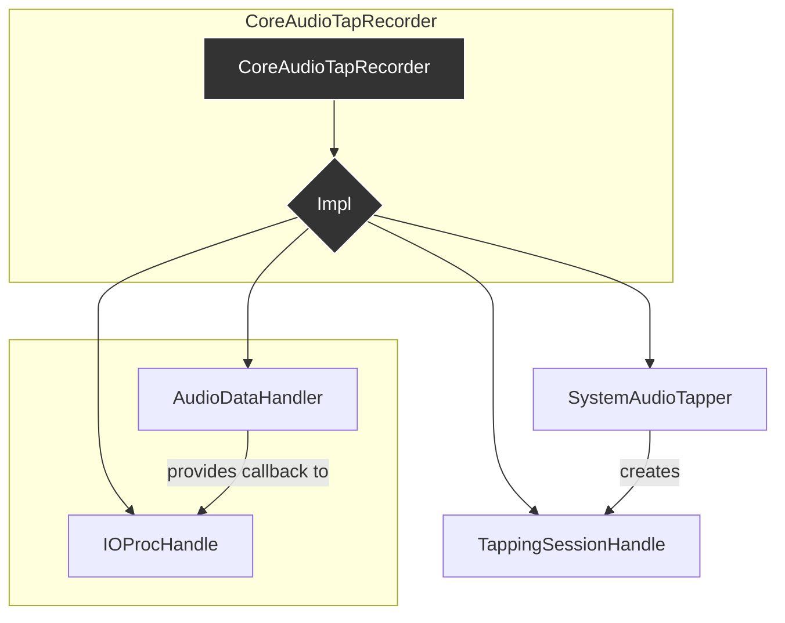

# Analysis: `CoreAudioTapRecorder`

**Last Updated**: 2025-07-22

This document provides a detailed analysis of the `CoreAudioTapRecorder` class, which serves as the primary public interface for the system audio recording feature. It utilizes the Pimpl (Pointer to Implementation) idiom to hide implementation details.

## 1. Current Functionality & Relationships

`CoreAudioTapRecorder` acts as a high-level state machine and coordinator. It orchestrates the complex interactions between the various components responsible for tapping system audio, processing it, and saving it to a file.

### Core Functionality:

*   **`startRecording(outputFile)`**: Initiates the recording process. It acquires a system audio tapping session, sets up the IOProc for data capture, and prepares the data handler.
*   **`stopRecording()`**: Manually stops an ongoing recording.
*   **`isRecording()`**: Checks if the recorder is currently in a recording or stopping state.
*   **`hasRecordingFinished()`**: Checks if the recording has completed (either successfully or with an error).

### State Management:

The `CoreAudioTapRecorder::Impl` class manages its state via a `std::atomic<RecorderState>`. The possible states are:
*   `Idle`
*   `Starting`
*   `Recording`
*   `Stopping`
*   `Succeeded`
*   `Failed`

It also tracks the reason for stopping (`StopReason`) to differentiate between user requests, buffer full events, device changes, or errors.

### Relationships with Other Components:

`CoreAudioTapRecorder` is the central coordinator. Its `Impl` class holds and manages the lifecycles of all other key components.

*   **`SystemAudioTapper`**: Acquires a `TappingSessionHandle` from this singleton.
*   **`TappingSessionHandle`**: RAII wrapper that manages the CATap session and provides access to device IDs and audio formats. It also notifies the recorder of device property changes.
*   **`IOProcHandle`**: RAII wrapper that manages the `AudioDeviceIOProc`. It is configured with a lambda that captures a raw pointer to `AudioDataHandler`.
*   **`AudioDataHandler`**: Manages the audio buffer, processes incoming data from the `IOProcHandle`, and saves the final result to a file.

## 2. Implementation Analysis & Improvement Suggestions

The current implementation is robust, leveraging modern C++ features and RAII to ensure safety. However, there are areas where the design could be further refined.

### Analysis of State Management & Thread Safety

*   **Good**: The use of `std::atomic<RecorderState>` and `compare_exchange_strong` is excellent for managing state transitions in a thread-safe manner, which is crucial given the asynchronous nature of Core Audio callbacks. The state machine logic appears sound.
*   **Good**: The use of `juce::MessageManager::callAsync` to move the stop logic onto the main message thread is a correct and safe way to handle cleanup from different threads (audio thread, property listener thread).
*   **Could Improve (Minor)**: The `StopReason` enum is closely tied to the `RecorderState`. While currently an implementation detail, if the public API needed to expose *why* a recording stopped, this `StopReason` would need to be part of the public interface. This is not a current requirement, but worth noting.

### Analysis of Resource Management and Lifecycles

*   **Good**: The Pimpl idiom is well-executed, cleanly separating the interface from the complex implementation.
*   **Good**: The use of RAII wrappers (`TappingSessionHandle`, `IOProcHandle`) dramatically simplifies resource management. The destructor of `Impl` correctly handles the case where a recording is active upon destruction.
*   **Could Improve (Potential Risk)**: In `setupIOProc`, the lambda captures a raw pointer to `audioDataHandler_.get()`. The comment correctly notes that `audioDataHandler_` must be declared before `ioProcHandle_` to ensure correct initialization order. C++ guarantees destruction in the reverse order of declaration, so `ioProcHandle_` (and its contained lambda) will be destroyed before `audioDataHandler_`, making the raw pointer safe in this specific context. However, this creates a hidden dependency. If a future developer reorders the member variables, it could lead to a dangling pointer. This is a classic, subtle C++ pitfall.

### Analysis of `startRecording` Logic

*   **Good**: The setup process is a clear sequence of steps (`setupInitialState`, `setupTappingSession`, `setupIOProc`), with cleanup (`cleanupAfterFailure`) on any failure.
*   **Could Improve (Error Propagation)**: The `startRecording` function returns a `bool`. While this indicates success or failure, it doesn't convey *why* it failed. A more informative return type, like `std::expected` (C++23) or a custom result `struct`, could provide detailed error information back to the caller. This would be very useful for debugging setup issues.
*   **Could Improve (Hardcoded values)**: The `AudioDataHandler` is initialized with a hardcoded duration of 600 seconds. This should be a configurable parameter, perhaps passed into `startRecording`.

### Analysis of `hasRecordingFinished`

*   **Ambiguity**: The public API has `isRecording()` and `hasRecordingFinished()`. This is slightly ambiguous. A caller might expect `isRecording() == false` implies `hasRecordingFinished() == true`, but there's also the `Idle` state. A single, more comprehensive `getStatus()` method returning a public `enum` could provide clearer state information to the caller (e.g., `Status::Ready`, `Status::Recording`, `Status::Finished`, `Status::Error`).

## 3. Refactoring Plan

### Phase 1: Enhance API and Configuration

1.  **Make Recording Duration Configurable**:
    *   Modify `CoreAudioTapRecorder::startRecording` to accept a duration parameter (e.g., `std::chrono::seconds duration`).
    *   Pass this duration to the `AudioDataHandler` constructor, removing the hardcoded `600`.

2.  **Improve State Reporting**:
    *   Create a public `enum class Status { Idle, Recording, FinishedSuccess, FinishedError };`.
    *   Create a public method `getStatus() const -> Status`.
    *   This method would map the internal `RecorderState` (`Idle`, `Recording`/`Stopping`, `Succeeded`, `Failed`) to the simpler public `Status`.
    *   Deprecate or remove `isRecording()` and `hasRecordingFinished()` in favor of the new `getStatus()` method for a clearer, unified API.

### Phase 2: Improve Internal Safety and Error Handling

1.  **Strengthen `IOProcHandle` Lambda Capture**:
    *   To eliminate the risk of a dangling pointer, change `ioProcHandle_` from `std::optional<IOProcHandle>` to `std::unique_ptr<IOProcHandle>`.
    *   Change the capture in the lambda from a raw pointer `[handler = audioDataHandler_.get()]` to capturing the `std::unique_ptr` of the data handler itself by move: `[handler = std::move(audioDataHandler_)]`.
    *   This makes the ownership explicit: the `IOProcHandle` now co-owns the `AudioDataHandler` with the `CoreAudioTapRecorder::Impl` (or takes full ownership if we change the member variable).
    *   *Alternative (Simpler)*: Instead of moving ownership, pass a `std::weak_ptr` to the lambda. The `AudioDataHandler` member would become a `std::shared_ptr`. Inside the lambda, lock the `weak_ptr` to get a `shared_ptr`. This is the safest pattern for C++ callbacks that might outlive the object they point to, though it adds the overhead of `shared_ptr`. Given the current destructor order, this is likely overkill but is the most robust solution.

2.  **Improve `startRecording` Error Reporting**:
    *   Define a `struct StartResult { bool success; std::string errorMessage; };`.
    *   Change the return type of `startRecording` to `StartResult`.
    *   In `setupTappingSession` and `setupIOProc`, if a setup fails, populate the `errorMessage` field with a descriptive error before returning.
    *   The caller can then log the specific reason for the startup failure.

This refactoring plan focuses on making the class more configurable, its public API clearer, and its internal implementation even more robust against common C++ lifecycle pitfalls.