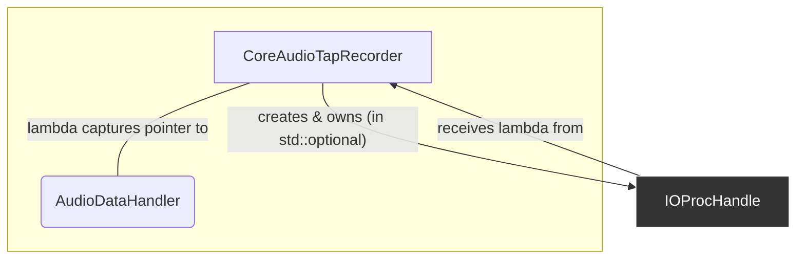

# Analysis: `IOProcHandle`

**Last Updated**: 2025-07-22

This document analyzes `IOProcHandle`, a crucial RAII (Resource Acquisition Is Initialization) wrapper class designed to manage the lifecycle of a Core Audio `AudioDeviceIOProcID`.

## 1. Current Functionality & Relationships

`IOProcHandle` encapsulates the setup and teardown of a real-time audio callback. Its primary purpose is to provide a safe, modern C++ interface for an otherwise verbose and error-prone C-style API.

### Core Functionality:

*   **Constructor (`IOProcHandle(deviceID, callback)`)**:
    1.  Receives a device ID and a `std::function` callback.
    2.  Calls `AudioDeviceCreateIOProcID`, passing a static C-style callback function (`ioproc_callback`) and a pointer to the `IOProcHandle` instance (`this`) as the `inClientData`.
    3.  If successful, it calls `AudioDeviceStart` to begin receiving audio data.
    4.  If any step fails, it cleans up resources acquired so far, ensuring no `IOProcID` is leaked.
*   **Destructor (`~IOProcHandle()`)**:
    1.  If the `ioProcID_` is valid, it automatically calls `AudioDeviceStop` and then `AudioDeviceDestroyIOProcID`. This is the core of the RAII pattern, guaranteeing that the audio callback is properly deregistered and destroyed when the `IOProcHandle` object goes out of scope.
*   **Move Semantics**: The class correctly implements a move constructor and move assignment operator. This allows the handle to be efficiently moved (e.g., when stored in a `std::optional` or `std::unique_ptr`), ensuring that only one object "owns" the Core Audio resource at any time.
*   **Static Callback (`ioproc_callback`)**: This C-style function serves as the bridge from Core Audio back to the C++ object world. It receives the `inClientData` pointer, casts it back to an `IOProcHandle*`, and invokes the member `callback_` with the incoming audio data.

### Relationships with Other Components:



*   **`CoreAudioTapRecorder`**: Creates and owns the `IOProcHandle` (via a `std::optional`). It constructs the handle with a lambda that captures a pointer to its `AudioDataHandler` instance.
*   **Itself (`this`)**: The class passes a pointer to itself to the C API, which is a standard pattern for instance-based callbacks in C.

## 2. Implementation Analysis & Improvement Suggestions

The class is a textbook example of a well-implemented RAII wrapper for a C API. The use of move semantics is also excellent. The analysis highlights areas for potential refinement rather than critical flaws.

### Analysis of RAII and Lifecycle Management

*   **Good**: The constructor/destructor pairing for resource management is perfect. It reliably prevents resource leaks. The move semantics correctly transfer ownership and null out the moved-from object.
*   **Good**: The constructor's error handling is robust. If `AudioDeviceStart` fails, it correctly cleans up the `IOProcID` that was just created.
*   **Could Improve**: In the move assignment operator, the `if (this != &other)` check is correct. The subsequent `if (isValid())` is also correct, ensuring the currently managed resource is cleaned up before taking ownership of the new one. This is solid code. No significant improvement is needed here, but it's a good example of correctly implemented move-assignment for a resource-managing class.

### Analysis of the Callback Mechanism

*   **Good**: The use of `std::function` makes the class highly flexible and decoupled. It can accept any callable that matches the required signature (free functions, lambdas, member functions bound with `std::bind`). This was a key design improvement we made during development.
*   **Could Improve (Real-time Safety)**: As noted in the `AudioDataHandler` analysis, `std::function` carries a small risk on real-time threads due to potential allocations and type erasure overhead. While often negligible, in high-performance audio, it's a known "code smell". For the *absolute highest* safety, a template-based approach could be used.
*   **Could Improve (Clarity)**: The `ioproc_callback` is correctly implemented. A minor point of style could be to add a `jassert` or `assert` inside the callback to ensure `self` is not null, which would help catch logic errors during debugging. e.g., `jassert(self); if (self && self->callback_) ...`.

## 3. Refactoring Plan

The `IOProcHandle` is already very well-designed. The following refactoring suggestions are minor and aimed at achieving the highest level of C++ safety and performance, but the current implementation is already robust.

### Phase 1 (Optional): Maximize Real-Time Safety of Callback

This change would prioritize performance and real-time safety over the flexibility of `std::function`.

1.  **Templatize `IOProcHandle`**:
    *   Change the class definition to `template <typename CallbackType> class IOProcHandle`.
    *   The constructor would accept a `CallbackType&&` (a forwarding reference) instead of a `std::function`.
    *   The `callback_` member would become `CallbackType callback_`.

2.  **Update Call Site**:
    *   When `CoreAudioTapRecorder` creates the `IOProcHandle`, the type will be deduced automatically.
    *   `ioProcHandle_.emplace<decltype(processCallback)>(aggregateDeviceID, std::move(processCallback));`
    *   **Benefit**: This eliminates the `std::function` overhead entirely. The compiler will generate a specialized version of `IOProcHandle` for the exact lambda type, allowing for potential inlining and removing any chance of memory allocation on the audio thread.
    *   **Drawback**: This makes the class header-only (or requires explicit template instantiation), and slightly more complex to read for those unfamiliar with template metaprogramming. *Given the non-critical nature of this application, this is likely an over-optimization, but it represents a "best practice" for high-performance audio contexts.*

### Phase 2 (Recommended): Minor Safety and Readability Tweaks

1.  **Add Assertion to Static Callback**:
    *   In `ioproc_callback`, add an assertion to verify `inClientData` is not null before casting.
    ```cpp
    static OSStatus ioproc_callback(...)
    {
        // This should never happen if the C API is used correctly.
        // If it does, it's a critical logic error.
        jassert(inClientData); 
        auto *self = static_cast<IOProcHandle *>(inClientData);
        if (self && self->callback_) { 
            self->callback_(inInputData); 
        }
        return noErr;
    }
    ```
2.  **Use `std::exchange` in Move Operations (Stylistic)**:
    *   The move operations can be made slightly more concise and idiomatic using `std::exchange`. This is purely a style improvement.
    ```cpp
    // Move Constructor
    IOProcHandle::IOProcHandle(IOProcHandle &&other) noexcept
      : ownerDeviceID_(std::exchange(other.ownerDeviceID_, kAudioObjectUnknown)),
        ioProcID_(std::exchange(other.ioProcID_, nullptr)),
        callback_(std::move(other.callback_))
    {}
    ```
    The move assignment operator could be similarly updated.

Given the robustness of the current implementation, only the minor tweaks from **Phase 2** are strongly recommended. The templating in **Phase 1** is a valuable technique to be aware of but is not critical for this project's immediate needs.