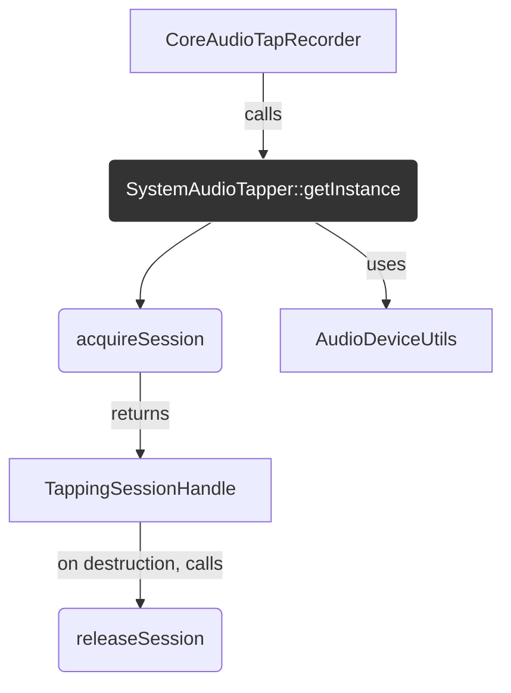

# Analysis: `SystemAudioTapper`

**Last Updated**: 2025-07-22

This document analyzes the `SystemAudioTapper` class, a singleton responsible for the low-level management of system-wide audio tapping resources, specifically the `CATap` and the associated aggregate audio device.

## 1. Current Functionality & Relationships

The `SystemAudioTapper` is the singleton entry point for creating and managing the underlying Core Audio objects required to tap system audio. It uses a session-based reference counting model to ensure that resources are only active when needed.

### Core Functionality:

*   **`getInstance()`**: Implements the Meyers' Singleton pattern, providing a single, thread-safe instance of the class.
*   **`acquireSession()`**: This is the main public method.
    1.  It acquires a lock to ensure thread safety.
    2.  If this is the first session (`activeSessions_ == 0`), it calls `setupTapAndAggregateDevice()` to create the necessary Core Audio resources.
    3.  If setup is successful, it increments the `activeSessions_` counter.
    4.  It returns a `TappingSessionHandle`, a RAII object that represents an active session. If setup fails, it returns an invalid handle.
*   **`releaseSession(...)`**: This method is `private` but is called by the `TappingSessionHandle` destructor (via `friend` access).
    1.  It acquires a lock.
    2.  It decrements the `activeSessions_` counter.
    3.  If the session count drops to zero, it destroys the `CATap` and the aggregate device, releasing the system resources.
*   **`~SystemAudioTapper()`**: The destructor acts as a final safety net, ensuring that if the singleton object is ever destroyed, it cleans up any lingering Core Audio objects.

### Core Logic (`setupTapAndAggregateDevice`):

This private method is the heart of the class. It performs a complex, ordered sequence of operations:
1.  Finds the default system output device using `utils::getDefaultOutputDevice()`.
2.  Creates a `CATapDescription` Objective-C object, which describes the tap's properties (e.g., which device to tap, mute behavior).
3.  Calls `findOrCreateAggregateDevice()`, which first searches the system for a pre-existing aggregate device with a specific UID. If not found, it creates a new one, configured to use the `CATap` UUID as its sub-device.
4.  Finally, it calls `AudioHardwareCreateProcessTap` to create the actual tap, using the previously configured `CATapDescription`.

### Relationships with Other Components:

*   **`TappingSessionHandle`**: This class is a "smart handle" returned by `acquireSession`. Its sole purpose is to call `SystemAudioTapper::releaseSession` upon its destruction, implementing the RAII pattern for session management. It has a `friend` relationship with `SystemAudioTapper`.
*   **`AudioDeviceUtils`**: Used to find the default output device.

## 2. Implementation Analysis & Improvement Suggestions

This class deals with some of the most complex and stateful parts of the Core Audio API. The singleton and session-counting model is a reasonable approach to managing these shared, system-level resources.

### Analysis of Singleton and Session Management

*   **Good**: The singleton pattern is appropriate here, as there should only ever be one entity managing the system-wide aggregate device and tap. The Meyers' Singleton (`static` local variable) is thread-safe in C++11 and later, which is good.
*   **Good**: The use of `std::lock_guard<std::mutex>` in `acquireSession` and `releaseSession` correctly protects the shared state (`activeSessions_`, device IDs) from race conditions.
*   **Good**: The RAII-based session management (`TappingSessionHandle`) is a very strong pattern. It ensures that sessions are always released, even if the `CoreAudioTapRecorder` encounters an exception or has a bug in its logic.
*   **Could Improve**: The parameters `tapID` and `aggregateDeviceID` in `releaseSession` are currently unused. This is likely a remnant of a previous design. They should be removed to clean up the signature.

### Analysis of Resource Management (C APIs and Objective-C)

*   **Good**: The destructor correctly cleans up resources, providing a safety net. The `releaseSession` logic also correctly cleans up when the last session is closed.
*   **Could Improve**: The `setupTapAndAggregateDevice` method deals with manually-managed Core Foundation and Objective-C objects, which is a potential source of leaks.
    *   `CFStringRef deviceUIDRef`: This is created with `AudioObjectGetPropertyData` and must be released with `CFRelease`. The code correctly releases it.
    *   `CATapDescription *tapDescription`: This is an Objective-C object created with `[[CATapDescription alloc] init...]`. It needs to be released with `[tapDescription release]`. The code correctly releases it after it has been used by both `findOrCreateAggregateDevice` and `AudioHardwareCreateProcessTap`.
    *   **Risk**: While the current code appears correct, this manual management is fragile. If a new code path were added that returned early, a leak could easily be introduced. Using C++ RAII wrappers (or, in this case, `juce::ScopedCFString` for `CFStringRef` and a `std::unique_ptr` with a custom deleter for the `CATapDescription`) would make this code safer and more robust.

### Analysis of Error Handling

*   **Good**: The `acquireSession` method correctly checks the return value of `setupTapAndAggregateDevice` and returns an invalid handle on failure.
*   **Could Improve**: The methods `setupTapAndAggregateDevice` and `findOrCreateAggregateDevice` return a `bool` or an `AudioDeviceID`, respectively. They do not propagate any information about *why* a failure occurred. For a complex system like this, knowing *which* Core Audio call failed and with what `OSStatus` code would be invaluable for debugging. The functions should return a `std::optional` or a struct containing both a success flag and an optional error code/message.

## 3. Refactoring Plan

### Phase 1: Improve Safety with RAII Wrappers for C/Obj-C Objects

1.  **Introduce an Objective-C RAII Wrapper**:
    *   In a shared utility header, define a simple `template<typename T> struct ObjCPtr { ... };` or use an existing one if available (JUCE has some helpers for this). This wrapper would be a `std::unique_ptr` with a custom deleter that calls `[ptr release];`.
    *   Refactor `setupTapAndAggregateDevice` to use this wrapper for the `CATapDescription` object. This guarantees it is released on all code paths.
    *   e.g., `ObjCPtr<CATapDescription> tapDescription = [[CATapDescription alloc] init...];`

2.  **Use `juce::ScopedCFString`**:
    *   JUCE already provides a RAII wrapper for `CFStringRef`.
    *   Refactor `setupTapAndAggregateDevice` to use `juce::ScopedCFString` for the `deviceUIDRef`. This guarantees `CFRelease` is called.

### Phase 2: Enhance Error Reporting

1.  **Create a Result Struct for Setup**:
    *   Define a struct like `struct SetupResult { bool success; OSStatus status = noErr; };`
    *   Change `setupTapAndAggregateDevice` to return `SetupResult`.
    *   Inside the function, when a Core Audio call fails, populate the `status` field before returning.
2.  **Propagate Errors**:
    *   In `acquireSession`, when `setupTapAndAggregateDevice` fails, log the `OSStatus` code. This will make diagnosing environment-specific setup problems (e.g., permissions, driver issues) much easier.

### Phase 3: API Cleanup

1.  **Clean `releaseSession` Signature**:
    *   Remove the unused `tapID` and `aggregateDeviceID` parameters from the `SystemAudioTapper::releaseSession` method declaration and definition.
    *   Update the call site in `TappingSessionHandle`'s destructor to match.

These changes would make the `SystemAudioTapper` significantly more robust against resource leaks and provide much better diagnostic information when things go wrong, without altering its core singleton/session-management logic.