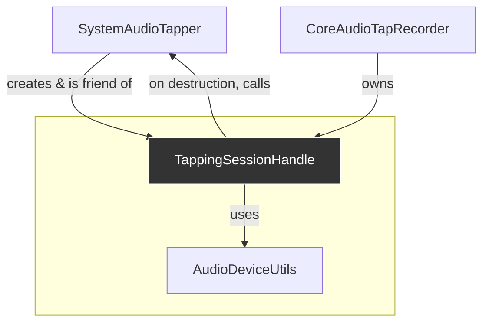

# Analysis: `TappingSessionHandle`

**Last Updated**: 2025-07-22

This document analyzes the `TappingSessionHandle` class. This is a non-copyable, move-only RAII handle that represents an active audio tapping session. Its primary role is to manage the session's lifecycle and provide an interface to the session's properties and events.

## 1. Current Functionality & Relationships

The `TappingSessionHandle` is the object that clients like `CoreAudioTapRecorder` interact with. It abstracts away the direct management of the underlying `SystemAudioTapper` singleton.

### Core Functionality:

*   **Lifecycle Management (RAII)**:
    *   The constructor is `private`, so instances can only be created by its `friend`, `SystemAudioTapper`.
    *   The destructor calls `release()`, which in turn calls `manager_->releaseSession()`. This ensures that for every handle created, a corresponding "release" call is made to the manager, correctly decrementing the session counter. This is the cornerstone of the session management system.
    *   Move semantics are correctly implemented to allow transfer of ownership of the session handle.
*   **Data Access**: Provides getter methods (`getTapSessionID`, `getAggregateDeviceID`, `getAudioFormat`, etc.) to expose necessary information from the tapping session to its owner.
*   **Property Listening**:
    *   `registerPropertyListener(callback)`: Allows the owner (`CoreAudioTapRecorder`) to subscribe to notifications about changes to the underlying audio device (e.g., format changes, device removal).
    *   `unregisterPropertyListener()`: Removes the listener.
    *   It uses a static C-style callback (`staticPropertyListenerCallback`) that casts `inClientData` back to a `TappingSessionHandle*` to invoke the C++ callback.

### Relationships with Other Components:

*   **`SystemAudioTapper`**: The only class that can create a `TappingSessionHandle`. The handle holds a raw pointer to the `SystemAudioTapper` singleton (`manager_`) to call back into it upon destruction.
*   **`CoreAudioTapRecorder`**: The owner of the handle. It uses the handle to get device/format information and to register for property change notifications.
*   **`AudioDeviceUtils`**: Used by the constructor to get the default output device ID, which is needed for querying the format and setting up property listeners.

## 2. Implementation Analysis & Improvement Suggestions

This class is well-designed and robustly implements the RAII pattern for session management. The analysis focuses on potential simplifications and making the raw pointer usage safer.

### Analysis of Lifecycle and RAII

*   **Good**: The RAII implementation is flawless. The destructor ensures `release()` is always called. The move semantics correctly transfer ownership and prevent double-releases.
*   **Good**: The `friend` relationship with `SystemAudioTapper` is a good way to enforce the "factory" pattern, where only the manager can create handles.

### Analysis of the Manager Pointer

*   **Could Improve (Pointer Safety)**: The class holds a raw pointer, `SystemAudioTapper *manager_`. This works because `SystemAudioTapper` is a Meyers' Singleton, which means its lifetime is tied to the program's lifetime, so it will not be destroyed before any `TappingSessionHandle` instances. Therefore, the raw pointer will not dangle.
*   **However**, relying on this implicit lifetime guarantee is a potential "code smell". It makes the code less explicit about its assumptions. If the singleton implementation were ever changed (e.g., to a non-static instance), this code would break. A safer, more expressive pattern would be to use a `std::shared_ptr` or `std::weak_ptr` if the manager's lifetime were not guaranteed to outlive the handle. Given the current singleton design, the raw pointer is *safe*, but it's not the most modern or self-documenting approach.

### Analysis of the Property Listener

*   **Good**: The implementation correctly adds and removes listeners for multiple properties using a C-style static callback. The callback correctly dispatches to the member `std::function`.
*   **Could Improve**:
    *   **Resource Leak on Exception**: In `registerPropertyListener`, the code iterates and calls `AudioObjectAddPropertyListener` multiple times. If an exception were thrown midway through this loop (unlikely with this C API, but possible in theory), the listeners added so far would not be removed, leading to a resource leak. A "scope guard" or a more complex RAII object could make this more robust.
    *   **State Management**: The `unregisterPropertyListener` method nulls out the callback and resets the `defaultDeviceID_`. This is good practice, preventing dangling callbacks.
    *   **Callback Safety**: Similar to `IOProcHandle`, using `std::function` for a callback that can be invoked from a system thread has minor theoretical risks.

## 3. Refactoring Plan

The `TappingSessionHandle` is a strong piece of code. Refinements are minor and focus on defensive programming and explicitness.

### Phase 1: Clarify and Secure the Manager-Handle Relationship

1.  **Remove the Raw Pointer**:
    *   Change the `release()` method in `TappingSessionHandle` and the `releaseSession` method in `SystemAudioTapper` to be `static`.
    *   These static methods would now take the `tapSessionID` and `aggregateDeviceID` as arguments.
    *   `SystemAudioTapper::releaseSession` would call `getInstance()` internally to get the singleton instance to operate on.
    *   `TappingSessionHandle` no longer needs to store the `manager_` pointer.
    *   **Benefit**: This completely removes the raw pointer and the dependency on the manager's lifetime. The handle becomes a pure data object with RAII behavior, and the `releaseSession` logic is centralized within the `SystemAudioTapper`'s static method. This is a cleaner, safer, and more modern C++ design.

### Phase 2: Improve Listener Robustness (Optional)

This is likely an over-optimization for the current project but is a good practice.

1.  **Create a `PropertyListenerRAII` Wrapper**:
    *   Create a small class that takes a device ID, an array of property addresses, a callback, and a client data pointer in its constructor.
    *   The constructor would loop and call `AudioObjectAddPropertyListener`.
    *   The destructor would loop and call `AudioObjectRemovePropertyListener`.
    *   `TappingSessionHandle` would hold an instance of this wrapper (e.g., in a `std::unique_ptr`). `registerPropertyListener` would create this object, and `unregisterPropertyListener` would simply reset the pointer.
    *   **Benefit**: This fully automates the listener registration and deregistration, making it exception-safe and removing repetitive code.

After this refactoring, the `TappingSessionHandle` will be a more self-contained and robust RAII object, with fewer external dependencies and even safer resource management.